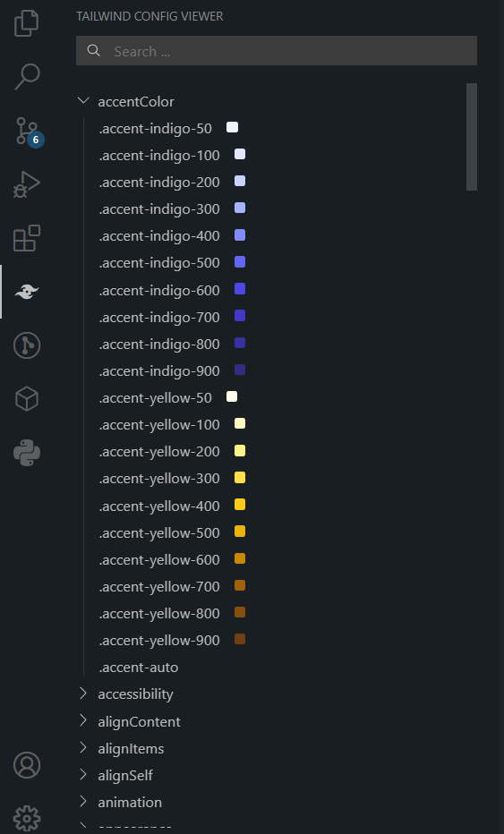

<h1 align="center">Tailwind Config Viewer</h1>

  

 
View the config of your Tailwind CSS project in a sidebar. It will show you all the colors, fonts, spacing, etc. that you have defined in your config file as per tailwind.config.js file.

 
 

# Screenshots

 

# Development
1. Clone the repo
2. run `npm install`
3. run `cd client && npm install`
4. Restart VS Code if you have it open

When you open the project in VS Code, tasks will run automatically to build src and client folder. You can also run manually using the scripts in package.json for both folders.